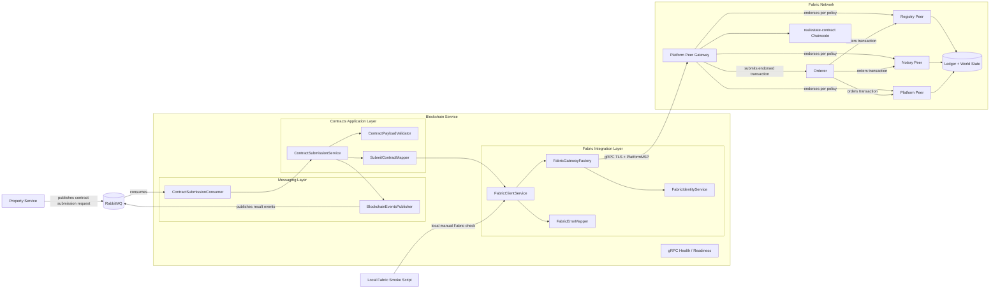
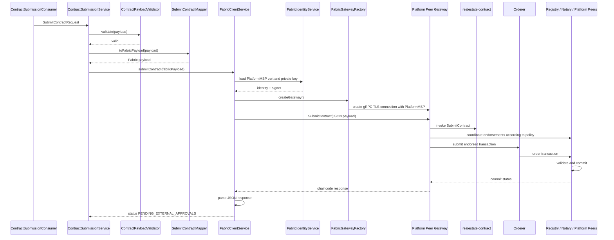

# Blockchain Service Fabric Communication Design

## Purpose

This document describes the internal design of Blockchain Service and how it
communicates with Hyperledger Fabric through the PlatformMSP identity.

Blockchain Service is implemented as a NestJS service under
`services/blockchain-service`. In the first MVP it uses RabbitMQ as the main
asynchronous integration path with Property Service, exposes gRPC only for
health/readiness checks, uses the Fabric Gateway SDK for Hyperledger Fabric
communication, uses PlatformMSP only, and has no local database.

## High-Level Component Design

## SubmitContract Sequence

This sequence represents the normal application submission path through
`ContractSubmissionService`.

The local Fabric smoke script bypasses `ContractSubmissionService` and calls
`FabricClientService` directly. It is intentionally limited to verifying Fabric
Gateway connectivity, `SubmitContract`, `GetContractByTxId`, and the
`PENDING_EXTERNAL_APPROVALS` status.

## PlatformMSP Boundary

Blockchain Service uses PlatformMSP only.

PlatformMSP can submit platform-side actions such as `SubmitContract` and
`ConfirmContract`. Blockchain Service must not simulate Registry or Notary
approval. `RegistryMSP` and `NotaryMSP` are separate institutional identities
and belong to future Registry/Notary institutional clients or services.

Legal/business approval is different from Fabric endorsement. Fabric
endorsement is a network validation mechanism defined by endorsement policy.
Registry and Notary legal approval are explicit business actions recorded by
the chaincode through `ApproveByRegistry`, `RejectByRegistry`,
`ApproveByNotary`, and `RejectByNotary`; those actions are outside Blockchain
Service scope.

## What SubmitContract Means

`SubmitContract` records the contract package on Fabric. It stores hashes,
CIDs, lifecycle state, and platform submission proof.

It does not store full PDF documents. Full documents remain outside the ledger,
with Fabric storing hashes and content identifiers needed for verification.

It also does not mean the contract is legally confirmed. The expected lifecycle
status immediately after `SubmitContract` is `PENDING_EXTERNAL_APPROVALS`.

## What Happens Later

Later workflow steps are handled by separate actors:

- Registry approval client invokes `ApproveByRegistry` or `RejectByRegistry`.
- Notary approval client invokes `ApproveByNotary` or `RejectByNotary`.
- Platform workflow may invoke `ConfirmContract` only after both approvals
  exist.
- RabbitMQ integration publishes `blockchain.contract.submitted` when
  submission succeeds.
- RabbitMQ integration publishes `blockchain.contract.submission.failed` when
  submission fails.

## Current Scope

The current local smoke test scope is direct Fabric client verification:

- `FabricClientService.submitContract`.
- `FabricClientService.getContractByTxId`.
- Status verification that the submitted record is
  `PENDING_EXTERNAL_APPROVALS`.

Not covered yet:

- RabbitMQ end-to-end flow.
- Property Service integration.
- RabbitMQ consumer execution.
- `ContractSubmissionService` orchestration.
- `ContractPayloadValidator`.
- `SubmitContractMapper`.
- Registry/Notary approvals.
- `ConfirmContract`.
- Full end-to-end transaction flow.
